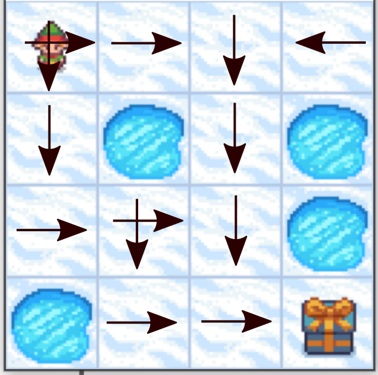

# Robot Movement


# Description

The game starts with the robot at location [0,0] of the grid world with the goal located at far extent of the world e.g. [3,3] for the 4x4 environment.

Obstacles in the path are distributed in set locations when using a pre-determined map or in random locations when a random map is generated.

The robot makes moves until they reach the goal or hit an obstacle.

Randomly generated worlds will always have a path to the goal.


## Action Space

The action shape is (1,) in the range {0, 3} indicating which direction to move the robot.

0: Move left

1: Move down

2: Move right

3: Move up

# Observation Space

The observation is a value representing the robot’s current position as current_row * nrows + current_col (where both the row and col start at 0).

Observation Space provides exact location of one with respect to rows and cols


# Rewards
Reward schedule:

Reach goal: +1

Reach boundary: 0

Reach obstacle: 0

# Run demo
- In order to run demo , you need to do  as the following. This command will save model as .pt extension for later usage. If you want to train model - > frozen_lake.train(3000, is_slippery=is_slippery)
- Once you have model pretrained then put script in test and evaluation mode - >  frozen_lake.test(10, is_slippery=is_slippery)

- In Both cases, you need to run robot.py file. 

- Script will save inference results to videos folder!
```shell
python3 robot.py
```


